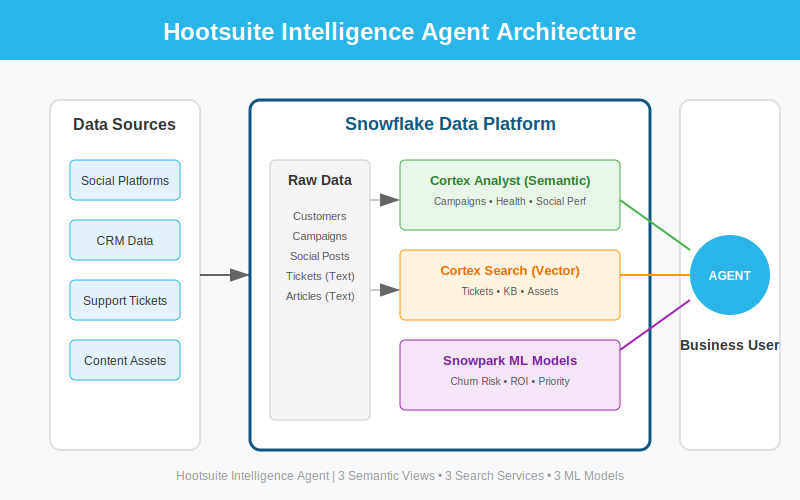
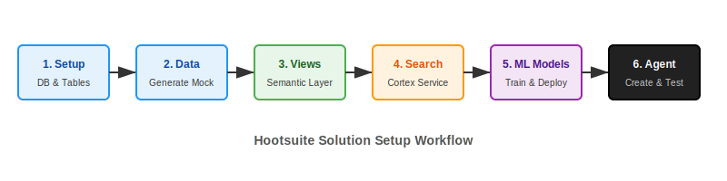

# Troon Intelligence Agent Solution

**An Enterprise-Grade AI Analytics Platform for Golf Course Management & Hospitality**

This repository contains a complete, production-ready implementation of a **Snowflake Intelligence Agent** tailored for Troon and its subsidiary, **RealFood Hospitality, Strategy and Design**. It unifies structured analytics, unstructured data search, and machine learning predictions into a single conversational interface.

---

## 🏗 System Architecture

The solution leverages the full power of the Snowflake AI Data Cloud, integrating **Cortex Analyst** for structured queries, **Cortex Search** for vector-based document retrieval, and **Snowpark ML** for predictive modeling.

### Key Capabilities

| Component | Technology | Functionality |
|-----------|------------|---------------|
| **Descriptive Analytics** | **Cortex Analyst** | Natural language queries over 4 Semantic Views (Course Performance, Member Analytics, Pro Shop Insights, RealFood Projects). |
| **Semantic Search** | **Cortex Search** | Vector search over Course Reviews, Maintenance Logs, Club Policies, and RealFood Services. |
| **Predictive AI** | **Snowpark ML** | 3 Custom ML Models: Churn Risk Prediction, No-Show Probability, Upgrade Candidate Identification. |
| **Orchestration** | **Cortex Agents** | A unified agent that intelligently routes queries to the correct tool or model. |

---

## 📂 Repository Structure

---

## 🚀 Getting Started

Follow the **[Detailed Setup Guide](docs/TROON_SETUP_GUIDE.md)** for step-by-step instructions.

### Deployment Workflow

1.  **Initialize Environment** (`sql/setup/`): Create database, schema, and tables.
2.  **Hydrate Data** (`sql/data/`): Generate synthetic production-grade data.
3.  **Deploy Views** (`sql/views/`): Create feature views and semantic views.
4.  **Enable Search** (`sql/search/`): Index unstructured text data using Cortex Search.
5.  **Train Models** (`notebooks/`): Train and register ML models using Snowpark.
6.  **Create ML Functions** (`sql/ml/`): Expose ML models as SQL functions.
7.  **Launch Agent** (`sql/agent/`): Compile the final Intelligence Agent with all capabilities.

---

## 💡 Example Use Cases

Once deployed, the agent can answer complex business questions:

**Analytics & Insights:**
*   **"Which course generated the most revenue last month?"** (Semantic View)
*   **"How many Platinum members do we have?"** (Semantic View)
*   **"What are members saying about the greens at Troon North?"** (Cortex Search)
*   **"List active RealFood projects in the Hotel sector."** (Semantic View)

**Predictive Intelligence:**
*   **"Predict the churn risk for our Gold members"** (ML Model)
*   **"What is the risk of no-shows for bookings in the next 7 days?"** (ML Model)

---

**Built for Troon | Powered by Snowflake Cortex**
